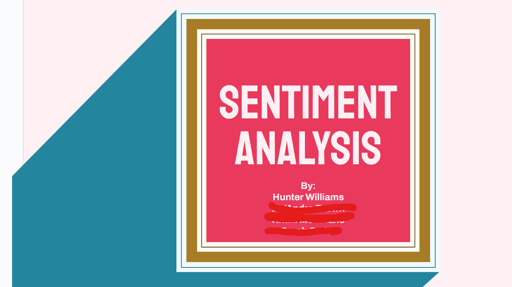
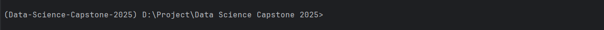
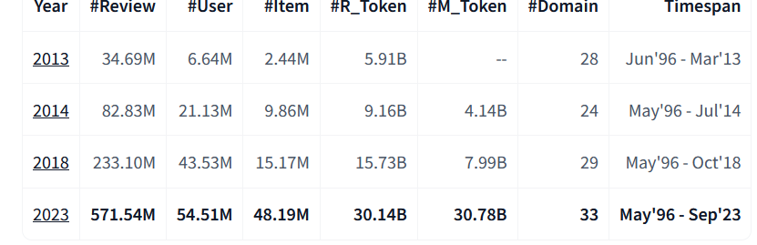

# Amazon Reviews Sentiment Analysis: Traditional Medicine

Version: 3.0.0  
Dataset: https://huggingface.co/datasets/McAuley-Lab/Amazon-Reviews-2023  
Tools: Anaconda, Jupyter (Not for most of the project!)  
Libraries: Pandas, spaCy, spellchecker, pyarrow (Included with pandas), sweetviz

## About

This was originally a semester project for a Data Science group. I am Hunter Williams of the posted group members that participated in it.
It takes text from amazon reviews and tries to predict the sentiment displayed in the review on a negative-positive scale.  

I was mad that the model wasn't working better so I messed with it a ton even after the semester ended. This is version THREE of this.
What I *consider* to be version three. This project is now about learning, something I personally did a lot of.


### Environment

Anaconda is required for this project to function.


Theoretically, you could install the necessary packages with pip only, but it probably won't work right the first time.
Included at the root of this project is a ```requirements.txt``` exported by ```pip``` and an ```environments.yml``` which is for anaconda.


#### Anaconda ```environments.yml```

This was exported using the command `conda env export > environment.yml`.  
You can *import* this environment by creating a new conda environment while specifying it
as the source `conda env -f environment.yml` and then activating it.

#### Pip
For requirements that aren't included in the anaconda environment, you can install the rest of the
necessary packages by using ```requirements.txt``` located in the root of this project.  

**Always install through anaconda first and THEN pip.**


## Dataset

We are using the unlabelled dataset found here: https://huggingface.co/datasets/McAuley-Lab/Amazon-Reviews-2023  
  

I use two source dataset sizes: 20,000 and 50,000, extracted from the above data and then broken up into two 10,000 and 25,000 data point groups.
* 10,000 / 25,000 of these samples are unfiltered.  
* 10,000 / 25,000 of these samples are taken from the dataset after filtering for **low subjective user review scores** (3-stars and under).  

### Fails:

Originally, we hand-annotated. This took too much time or it would have been way too costly on account of entertainment.
The act didn't - you could blow through 250 samples each in 30 minutes. It was simply mind-numbingly boring. In addition, it turns out there is a lot of personal bias and boundaries on 'should i ask the group for a majority' or 'guess out my ass'.  
Not good.    
So, we improvised: The use of costlier, pre-proven models for the prelabelling of a dataset! Get this:   
1. We have a pre-trained, much larger and more complex model (e.g. BERT) make classifications of the text beforehand.
2. We increase the accuracy of these classifications by taking the output between multiple models and comparing them for 'agreements' on data points.
(If both models think a particular text is rated 5 for very positve, then we keep it.
3. If there is a minor disagreement, such as one model predicting 4 and the other 5, then we take the higher or 'stronger' score.
4. Otherwise, the point is discarded.)  

#### Models Used to auto-classify:
- tabularisai/multilingual-sentiment-analysis
- LiYuan/amazon-review-sentiment-analysis
- DataMonke/bert-base-uncased-finetuned-review-sentiment-analysis


## Labels
The pre-labelled data we output from our group of classified has a label from 1 to 5, similar to the star score used in the actual reviews.
* A label of '1' would represent a very negative sentiment.  
* Conversely, a label of '5' would represent a very positive sentiment.  
These labels are not the same as the ratings (e.g. 1-star or 5-star) given in the dataset, and these ratings are not factored into training.

#### Label Distribution
The balance of labels in the dataset is not distributed equally. To make them such, oversampling or undersampling is performed. The evaluations below all had their model use oversampling to achieve distributive balance.

##### When Oversampled:

5    4012
1    1842
3     515

After:

1    2500
3    2500
5    2500	

##### When Undersampled:

Counter({5: 3020, 3: 2496, 1: 853})
Counter({1: 853, 3: 853, 5: 853})


## Methods

Labels are oversampled and stratified prior to being fed into a model. There are several models included in steps, both regressors and classifiers.
They can be plugged into or unplugged from the pipeline and evaluated on using the appropriate evaluation step.


## Results (Visual)


## Results (Data)


## RF, Dataset V2, Undersampled, TF-IDF, MinMax Scaling, No Bigram, 2 Chain Qualifiers
2025-05-12 18:40:24,037 [INFO] Best parameters from grid search: {'max_depth': 25, 'max_features': 'sqrt', 'min_samples_leaf': 1, 'min_samples_split': 10, 'n_estimators': 600}
2025-05-12 18:40:24,037 [INFO] Training complete for random_forest_classification.
22025-05-12 18:40:24,282 [INFO] Accuracy: 0.6987
2025-05-12 18:40:24,288 [INFO] Precision (macro): 0.6597
2025-05-12 18:40:24,293 [INFO] Recall (macro): 0.7066
2025-05-12 18:40:24,297 [INFO] F1 Score (macro): 0.6692

## RF, Dataset V2, Undersampled, BOW, MinMax Scaling, No Bigram, 2 Chain Qualifiers
2025-05-13 00:22:34,805 [INFO] Best parameters from grid search: {'max_depth': 25, 'max_features': 'sqrt', 'min_samples_leaf': 1, 'min_samples_split': 15, 'n_estimators': 400}
2025-05-13 00:22:34,805 [INFO] Training complete for random_forest_classification.
2025-05-13 00:22:34,972 [INFO] Accuracy: 0.7056
2025-05-13 00:22:34,980 [INFO] Precision (macro): 0.6645
2025-05-13 00:22:34,982 [INFO] Recall (macro): 0.7053
2025-05-13 00:22:34,985 [INFO] F1 Score (macro): 0.6735

## RF, Dataset V2, Undersampled, spaCy, L2 Normalized, No Bigram, 2 Chain Qualifiers
2025-05-14 02:48:05,389 [INFO] Best parameters from grid search: {'max_depth': 25, 'max_features': 'sqrt', 'min_samples_leaf': 1, 'min_samples_split': 15, 'n_estimators': 600}
2025-05-14 02:48:05,390 [INFO] Training complete for random_forest_classification.
2025-05-14 02:48:06,035 [INFO] Accuracy: 0.5618
2025-05-14 02:48:06,042 [INFO] Precision (macro): 0.5308
2025-05-14 02:48:06,046 [INFO] Recall (macro): 0.5655
2025-05-14 02:48:06,050 [INFO] F1 Score (macro): 0.5294


## MNB, 3 Class, Dataset V2, Undersampled, TF-IDF, MinMax Scaling, No Bigram, 2 Chain Qualifiers
2025-05-14 09:28:15,931 [INFO] Best parameters from grid search: {'alpha': 1.0}
2025-05-14 09:28:15,931 [INFO] Training complete for multinomial_naive_bayes_classification.
2025-05-14 09:28:15,954 [INFO] Accuracy: 0.7338
2025-05-14 09:28:15,957 [INFO] Precision (macro): 0.6979
2025-05-14 09:28:15,960 [INFO] Recall (macro): 0.7165
2025-05-14 09:28:15,964 [INFO] F1 Score (macro): 0.7054


## MNB, 5 Class, Dataset V2, Undersampled, TF-IDF, MinMax Scaling, No Bigram, 2 Chain Qualifiers
2025-05-14 09:30:56,164 [INFO] Best parameters from grid search: {'alpha': 1.0}
2025-05-14 09:30:56,164 [INFO] Training complete for multinomial_naive_bayes_classification
2025-05-14 09:30:56,189 [INFO] Accuracy: 0.5261
2025-05-14 09:30:56,194 [INFO] Precision (macro): 0.4551
2025-05-14 09:30:56,198 [INFO] Recall (macro): 0.4623
2025-05-14 09:30:56,203 [INFO] F1 Score (macro): 0.4465


## Dataset (V2) 8k
Classification (Logistic Regression)  
Vectorizer: TF-IDF     
Normalization/Scaler: MinMax Scaling  
Balancing: Oversample  
Best parameters from grid search: {'C': 10, 'max_iter': 100, 'penalty': 'l2', 'solver': 'saga'}  
Training complete for 
logistic_regression.
Evaluating classification model...
Accuracy: 0.7219
Precision (macro): 0.5445
Recall (macro): 0.5445
F1 Score (macro): 0.5439

Classification (Logistic Regression)  
Vectorizer: TF-IDF with n gram 1-2 range     
Normalization/Scaler: L2 Normalizer 
Balancing: Oversample  
Best parameters from grid search: {'C': 10, 'max_iter': 100, 'penalty': 'l2', 'solver': 'saga'}  
Training complete for 
logistic_regression.
Evaluating classification model...
Accuracy: 0.7269
Recall (macro): 0.5824
F1 Score (macro): 0.5762

Classification (Logistic Regression)  
Vectorizer: BOW     
Normalization/Scaler: MinMax Scaling  
Balancing: Oversample  
Best parameters from grid search: {'C': 10, 'max_iter': 100, 'penalty': 'l2', 'solver': 'saga'}  
Training complete for 
logistic_regression.
Evaluating classification model...
Accuracy: 0.7520
Precision (macro): 0.5960
Recall (macro): 0.5999
F1 Score (macro): 0.5976

Classification (Logistic Regression)  
Vectorizer: BOW     
Normalization/Scaler: L2 Normalizer  
Balancing: Oversample  
Best parameters from grid search: {'C': 10, 'max_iter': 100, 'penalty': 'l2', 'solver': 'saga'}  
Training complete for 
logistic_regression.
Evaluating classification model...
Accuracy: 0.7232
Precision (macro): 0.5459
Recall (macro): 0.5448
F1 Score (macro): 0.5446

Classification (Logistic Regression)  
Vectorizer: spaCy     
Normalization/Scaler: MinMax Scaling  
Balancing: Oversample  
Best parameters from grid search: {'C': 10, 'max_iter': 100, 'penalty': 'l2', 'solver': 'saga'}  
Training complete for 
logistic_regression.
Evaluating classification model...
Accuracy: 0.5863
Precision (macro): 0.5026
Recall (macro): 0.5196
F1 Score (macro): 0.4872

Classification (Logistic Regression)  
Vectorizer: spaCy     
Normalization/Scaler: L2 Normalizer  
Balancing: Oversample  
Best parameters from grid search: {'C': 10, 'max_iter': 100, 'penalty': 'l2', 'solver': 'saga'}  
Training complete for 
logistic_regression.
Evaluating classification model...
Accuracy: 0.7244
Precision (macro): 0.5469
Recall (macro): 0.5459
F1 Score (macro): 0.5457


Classification (Gaussian Naive Bayes)  
Vectorizer: TF-IDF 
Normalization/Scaler: MinMax Scaling  
Balancing: Oversample  
Best Parameters: {'var_smoothing': 1e-08}  
Training complete for 
gauss_naive_bayes_classification.
Evaluating classification model...
Accuracy: 0.4375
Precision (macro): 0.4066
Recall (macro): 0.4000
F1 Score (macro): 0.3707 

Classification (Gaussian Naive Bayes)  
Vectorizer: TF-IDF 
Normalization/Scaler: L2 Normalizer  
Balancing: Oversample  
Best Parameters: {'var_smoothing': 1e-08}  
Training complete for 
gauss_naive_bayes_classification.
Evaluating classification model...
Accuracy: 0.4294
Precision (macro): 0.3916
Recall (macro): 0.3800
F1 Score (macro): 0.3588

Classification (Gaussian Naive Bayes)  
Vectorizer: spaCy 
Normalization/Scaler: MinMax Scaling  
Balancing: Oversample  
Best Parameters: {'var_smoothing': 1e-08}  
Training complete for 
gauss_naive_bayes_classification.
Evaluating classification model...
Accuracy: 0.3622
Precision (macro): 0.4129
Recall (macro): 0.4109
F1 Score (macro): 0.3333

Classification (Gaussian Naive Bayes)  
Vectorizer: spaCy 
Normalization/Scaler: L2 Normalizer   
Balancing: Oversample  
Best Parameters: {'var_smoothing': 1e-08}  
Training complete for 
gauss_naive_bayes_classification.
Evaluating classification model...
Accuracy: 0.3622
Precision (macro): 0.4129
Recall (macro): 0.4109
F1 Score (macro): 0.3333

Classification (Gaussian Naive Bayes)  
Vectorizer: BOW 
Normalization/Scaler: MinMax Scaling 
Balancing: Oversample  
Best Parameters: {'var_smoothing': 1e-08}  
Training complete for 
gauss_naive_bayes_classification.
Evaluating classification model...
Accuracy: 0.4200
Precision (macro): 0.3958
Recall (macro): 0.3839
F1 Score (macro): 0.3561

Classification (Gaussian Naive Bayes)  
Vectorizer: BOW 
Normalization/Scaler: L2 Normalizer  
Balancing: Oversample  
Best Parameters: {'var_smoothing': 1e-08}  
Training complete for 
gauss_naive_bayes_classification.
Evaluating classification model...
Accuracy: 0.4407
Precision (macro): 0.4124
Recall (macro): 0.3999
F1 Score (macro): 0.3732

Classification (Multinomial Naive Bayes)  
Vectorizer: TF-IDF    
Normalization/Scaler: MinMax Scaling  
Balancing: Oversample  
Best Parameters: {'alpha': 0.1}  
Training complete for 
multinomial_naive_bayes_classification.
Evaluating classification model...
Accuracy: 0.6591
Precision (macro): 0.5129
Recall (macro): 0.5234
F1 Score (macro): 0.5147

Classification (Multinomial Naive Bayes)  
Vectorizer: TF-IDF    
Normalization/Scaler: L2 Normalizer 
Balancing: Oversample  
Best Parameters: {'alpha': 0.1}  
Training complete for 
multinomial_naive_bayes_classification.
Evaluating classification model...
Accuracy: 0.6924
Precision (macro): 0.5493
Recall (macro): 0.5678
F1 Score (macro): 0.5531

Classification (Multinomial Naive Bayes)  
Vectorizer: BOW    
Normalization/Scaler: MinMax Scaling 
Balancing: Oversample  
Best Parameters: {'alpha': 0.1}  
Training complete for 
multinomial_naive_bayes_classification.
Evaluating classification model...
Accuracy: 0.6723
Precision (macro): 0.5244
Recall (macro): 0.5350
F1 Score (macro): 0.5268

Classification (Multinomial Naive Bayes)  
Vectorizer: BOW    
Normalization/Scaler: L2 Normalizer 
Balancing: Oversample  
Best Parameters: {'alpha': 0.1}  
Training complete for 
multinomial_naive_bayes_classification.
Evaluating classification model...
Accuracy: 0.7068
Precision (macro): 0.5668
Recall (macro): 0.5886
F1 Score (macro): 0.5709


SVM, Scaling, TF-IDF, No Igram  
Best parameters from grid search: {'C': 200, 'gamma': 'scale', 'kernel': 'rbf'}  
Training complete for support_vector_classification.  
Evaluating classification model...  
Accuracy: 0.6353  
Precision (macro): 0.7740  
Recall (macro): 0.3429  
F1 Score (macro): 0.2790  


SVM, Scaling, BOW, No Ingram  
Best parameters from grid search: {'C': 200, 'gamma': 'scale', 'kernel': 'rbf'}  
Training complete for support_vector_classification.  
Evaluating classification model...  
Accuracy: 0.6560  
Precision (macro): 0.5168  
Recall (macro): 0.5146  
F1 Score (macro): 0.5068  


RF, Scaling, BOW, No ingram  
Best parameters from grid search: {'max_depth': None, 'min_samples_leaf': 1, 'min_samples_split': 5, 'n_estimators': 400}  
Training complete for random_forest_classification.  
Evaluating classification model...  
Accuracy: 0.7100  
Precision (macro): 0.5554  
Recall (macro): 0.5384  
F1 Score (macro): 0.5292  


RF, Scaling, TF-IDF, No ingram  
Best parameters from grid search: {'max_depth': None, 'min_samples_leaf': 1, 'min_samples_split': 5, 'n_estimators': 400}  
Training complete for random_forest_classification.  
Evaluating classification model...  
Accuracy: 0.7144  
Precision (macro): 0.5552  
Recall (macro): 0.5433  
F1 Score (macro): 0.5367  


RF, Normalization, SpaCy, No ingram  
Best parameters from grid search: {'max_depth': None, 'min_samples_leaf': 1, 'min_samples_split': 5, 'n_estimators': 400}  
Training complete for random_forest_classification.  
Evaluating classification model...  
Accuracy: 0.6905  
Precision (macro): 0.5049  
Recall (macro): 0.4653  
F1 Score (macro): 0.4581  


KNN, Normalization, SpaCy, no Ingram  
Best parameters from grid search: {'metric': 'manhattan', 'n_neighbors': 2, 'weights': 'distance'}  
Training complete for k_nearest_neighbors_classification.  
Evaluating classification model...  
Accuracy: 0.4739  
Precision (macro): 0.3845  
Recall (macro): 0.3902  
F1 Score (macro): 0.3751  


KNN, Scaling, BOW, no Ingram  
Best parameters from grid search: {'metric': 'manhattan', 'n_neighbors': 2, 'weights': 'distance'}  
Training complete for k_nearest_neighbors_classification.  
Evaluating classification model...  
Accuracy: 0.5838  
Precision (macro): 0.4346  
Recall (macro): 0.4386  
F1 Score (macro): 0.4350  