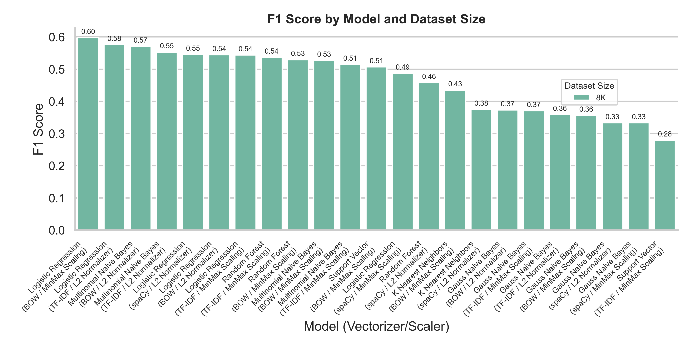
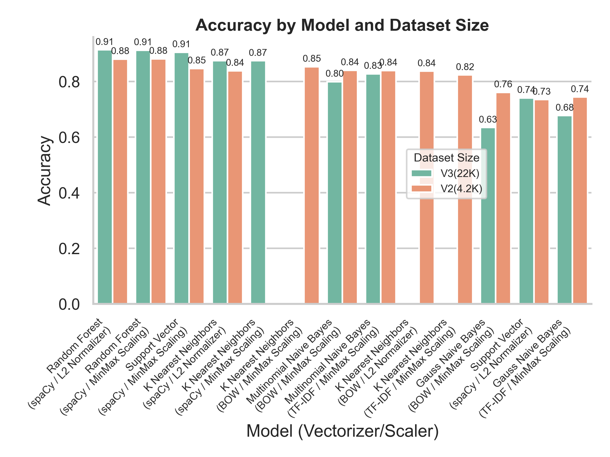
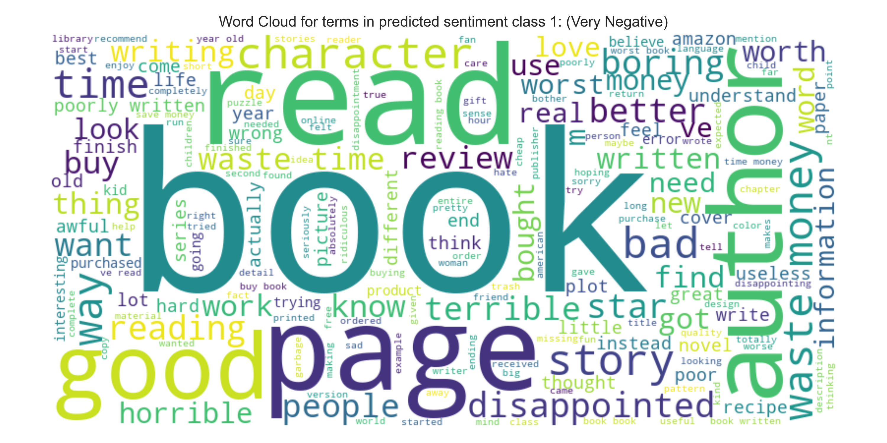
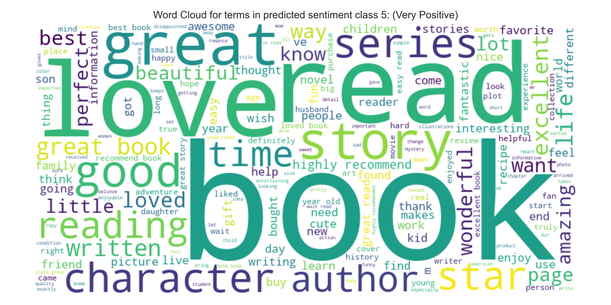

## Data Science Capstone
________________________

Dataset: https://huggingface.co/datasets/McAuley-Lab/Amazon-Reviews-2023
 
Tools: Anaconda, Jupyter
 
Libraries: Pandas, spaCy, pyarrow (Included with pandas), sweetviz

### Environment
Anaconda is required for this project to function. Theoretically, you could install these packages with pip only,
but it probably won't work right.

#### Anaconda
Included in the root of the project is an anaconda environment .yml file.
This was exported using the command `conda env export > environment.yml`.

You can *import* this environment by creating a new conda environment while specifying it
as the source `conda env -f encironment.yml` and then activating it.

#### Pip
For requirements that aren't included in the anaconda environment, you can install the rest of the
necessary packages by using pip's `requirement.txt` file - also located in the root of this project.
**Always install through anaconda first and THEN pip.**

## Dataset

We are using the unlabelled dataset found here: https://huggingface.co/datasets/McAuley-Lab/Amazon-Reviews-2023
From this dataset, we pull 10,000 samples. 5000 of these samples are unfiltered, and because of the high ratio of good ratings to bad,
5000 of these samples are filtered to be taken only from reviews whose score is '3 stars' or less.
 
 
Originally, we hand-annotated. This took too much time, so we came up with a new method: multi-model pre-predictions.
We have a pre-trained, much larger and more complex model (e.g. BERT) make classifications of the text beforehand. We
reduce the likelihood of innaccurate predictions by taking the output betwen multiple models and compare them for 'agreements' on data points.
(If both models think a particular text is rated 5 for very positve, then we keep it. If there is a minor disagreement, such as one model predicting 4 and the other 5, then we take the higher or 'stronger' score. Otherwise, the point is discarded.)
 
 
Using this method, we increased the original 1000 data points to 4200 data points out of 10000 pulled. I repeat this process
for dataset v3 with 21,000 data points out of 50000 used.

### Models Used to autoclassify:
- tabularisai/multilingual-sentiment-analysis
- LiYuan/amazon-review-sentiment-analysis
- DataMonke/bert-base-uncased-finetuned-review-sentiment-analysis

  
## Labels

Data is labelled on a scale of 1-5, similar to the star score used in the actual reviews. A label of '1' would represent a very negative sentiment. Conversely, a label of '5' would represent a very positive sentiment.
These labels are not the same as the ratings (e.g. 1-star or 5-star) given in the dataset, and these ratings are not factored into the model.

#### Label Distribution
The balance of labels in the dataset is not distributed equally. To make them such, oversampling or undersampling is performed. The evaluations below all had their model use oversampling to achieve distributive balance.

2025-04-27 15:33:52,370 [INFO] Label counts before balancing: 
label
5    1237
2     787
1     688
3     668
4     346
Name: count, dtype: int64
2025-04-27 15:33:52,382 [INFO] Label balancing complete using oversample method.
2025-04-27 15:33:52,383 [INFO] Label counts after balancing: 
label
4    1237
2    1237
1    1237
5    1237
3    1237

2025-04-27 16:10:08,570 [INFO] Label counts before balancing: 
label
5    7487
3    3924
2    3029
1    2784
4    1982
Name: count, dtype: int64
2025-04-27 16:10:08,673 [INFO] Label balancing complete using oversample method.
2025-04-27 16:10:08,675 [INFO] Label counts after balancing: 
label
4    7487
1    7487
5    7487
3    7487
2    7487
Name: count, dtype: int64

## Methods

Labels are oversampled and stratified prior to being fed into a model. There are several models included in steps, both regressors and classifiers.
They can be plugged into or unplugged from the pipeline and evaluated on using the appropriate evaluation step.

## Results (Visual)

## Results (Data)

### 10K Dataset (v2)

Classification (Random Forest):  
Vectorizer: spaCy  
Normalization: L2 Normalizer  
Balancing: Oversample  
Best Parameters: {'max_depth': None, 'min_samples_leaf': 1, 'min_samples_split': 2, 'n_estimators': 300}  
Model: random_forest_classification.
Accuracy: 0.8804  
F1 Score (macro): 0.8801  
  

Classification (Random Forest):  
Vectorizer: spaCy  
Normalization/Scaler: MinMax Scaling  
Balancing: Oversample  
Best Parameters: {'max_depth': 25, 'min_samples_leaf': 1, 'min_samples_split': 5, 'n_estimators': 300}  
Model: random_forest_classification.
Accuracy: 0.8812  
F1 Score (macro): 0.8813  
  

Classification (Support Vector Machine):  
Vectorizer: spaCy  
Normalization: L2 Normalizer  
Balancing: Oversample  
Best Parameters: {'C': 100, 'gamma': 'scale', 'kernel': 'poly'}  
Model: support_vector_classification.
Accuracy: 0.7348  
F1 Score (macro): 0.7340    

Classification (Support Vector Machine):  
Vectorizer: spaCy  
Normalization/Scaler: MinMax Scaling  
Balancing: Oversample  
Best Parameters: {'C': 200, 'gamma': 'scale', 'kernel': 'poly'}  
Model: support_vector_classification.
Accuracy: 0.8464  
F1 Score (macro): 0.8463  
 

Classification (Multinomial Naive Bayes)  
Vectorizer: BOW  
Normalization/Scaler: MinMax Scaling  
Balancing: Oversample  
Best Parameters: {'alpha': 0.1}  
Model: multinomial_naive_bayes_classification.
Accuracy: 0.8399  
F1 Score (macro): 0.8387  

Classification (Multinomial Naive Bayes)  
Vectorizer: TF-IDF    
Normalization/Scaler: MinMax Scaling  
Balancing: Oversample  
Best Parameters: {'alpha': 0.1}  
Model: multinomial_naive_bayes_classification.
Accuracy: 0.8391   
F1 Score (macro): 0.8375  

Classification (Gaussian Naive Bayes)  
Vectorizer: BOW  
Normalization/Scaler: MinMax Scaling  
Balancing: Oversample  
Best Parameters: {'var_smoothing': 1e-07}  
Model: gauss_naive_bayes_classification.  
Accuracy: 0.7607  
F1 Score (macro): 0.7575  

Classification (Gaussian Naive Bayes)  
Vectorizer: TF-IDF    
Normalization/Scaler: MinMax Scaling  
Balancing: Oversample  
Best Parameters: {'var_smoothing': 1e-07}  
Model: gauss_naive_bayes_classification.  
Accuracy: 0.7437  
F1 Score (macro): 0.7392  

### 22k Dataset (v3)

Classification (Random Forest)  
Vectorizer: spaCy  
Normalization/Scaler: L2 Normalizer  
Balancing: Oversample (30k total)  
Best Parameters: {'max_depth': 25, 'min_samples_leaf': 1, 'min_samples_split': 5, 'n_estimators': 400}  
Model: random_forest_classification.
Accuracy: 0.9134  
F1 Score (macro): 0.9135  

Classification (Random Forest)  
Vectorizer: spaCy  
Normalization/Scaler: MinMax Scaling  
Balancing: Oversample (30k total)  
Best Parameters: {'max_depth': 25, 'min_samples_leaf': 1, 'min_samples_split': 5, 'n_estimators': 400}  
Model: random_forest_classification.
Accuracy: 0.9120  
F1 Score (macro): 0.9121  

Classification (Gaussian Naive Bayes)  
Vectorizer: BOW  
Normalization/Scaler: MinMax Scaling  
Balancing: Oversample  (30k total)  
Best Parameters: {'var_smoothing': 1e-07}  
Model: gauss_naive_bayes_classification.
Accuracy: 0.6342  
F1 Score (macro): 0.6327  

Classification (Gaussian Naive Bayes)  
Vectorizer: TF-IDF  
Normalization/Scaler: MinMax Scaling  
Balancing: Oversample  (30k total)  
Best Parameters: {'var_smoothing': 1e-07}  
Model: gauss_naive_bayes_classification.
Accuracy: 0.6772  
F1 Score (macro): 0.6712  

Classification (Multinomial Naive Bayes)  
Vectorizer: BOW  
Normalization/Scaler: MinMax Scaling  
Balancing: Oversample  (30k total)  
Best Parameters: {'alpha': 0.1}  
Model: multinomial_naive_bayes_classification.
Accuracy: 0.7991  
F1 Score (macro): 0.7992  

Classification (Multinomial Naive Bayes)  
Vectorizer: TF-IDF  
Normalization/Scaler: MinMax Scaling  
Balancing: Oversample  (30k total)  
Best Parameters: {'alpha': 0.1}  
Model: multinomial_naive_bayes_classification.
Accuracy: 0.8274  
F1 Score (macro): 0.8270  

Classification (Support Vector Machine):  
Vectorizer: spaCy  
Normalization/Scaler: L2 Normalizer  
Balancing: Oversample  
Best Parameters: {'C': 200, 'gamma': 'scale', 'kernel': 'poly'}  
Model: support_vector_classification.
Accuracy: 0.7406  
F1 Score (macro): 0.7405  

Classification (Support Vector Machine):  
Vectorizer: spaCy  
Normalization/Scaler: MinMax Scaler  
Balancing: Oversample  
Best Parameters: {'C': 200, 'gamma': 'scale', 'kernel': 'poly'}  
Model: support_vector_classification.
Accuracy: 0.9050  
F1 Score (macro): 0.9047  